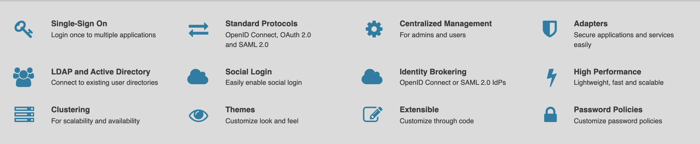

[](https://github.com/okancetin/keycloak-event-listener-example/releases)
[](https://github.com/okancetin/keycloak-event-listener-example/commits/main)


# keycloak-event-listener-example
An example Event Listener for Keycloak

## Table of contents
* [General info](#general-info)
* [Technologies](#technologies)
* [Setup](#setup)

## General info
This project is an example for extending Keycloak to listen events. It also shows how to connect Database using JpaConnectionProvider.java

## Technologies
Project is created with:
* Keycloak v11.0.1
* maven
* Java 11

## Setup
To run this project, run maven install and copy under the /deployments folder in Keycloak

```
$ mvn clean install
$ COPY ../target/event-listener-example-1.0.jar*.jar /opt/jboss/keycloak/standalone/deployments/
```

or run Dockerfile

Activate Event Listener in Keyclaok Admin Console